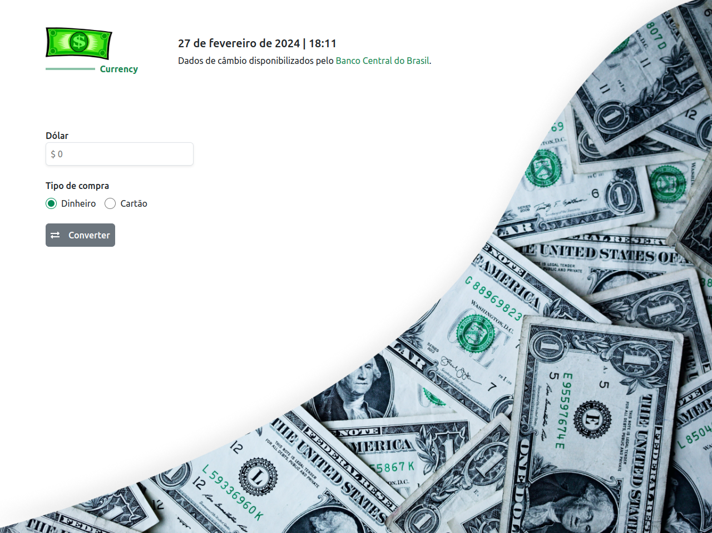

<h1 align="center">
    
</h1>

<p align="center">
  <a href="#-technologies">Technologies</a>&nbsp;&nbsp;&nbsp;|&nbsp;&nbsp;&nbsp;
  <a href="#-preview">Preview</a>&nbsp;&nbsp;&nbsp;|&nbsp;&nbsp;&nbsp;
  <a href="#-Getting-started">Getting started</a>&nbsp;&nbsp;&nbsp;|&nbsp;&nbsp;&nbsp;
  <a href="#-project">Project</a>
</p>

## 🧪 Technologies

This project was developed using the following technologies:

- [React](https://react.dev/)
- [Bootstrap](https://getbootstrap.com)
- [TypeScript](https://www.typescriptlang.org/)

## 🔥 Preview

[](https://conversao-moeda.pricarrenho.com.br/)

## 🚀 Getting started

Clone the project and access the folder

```bash
$ git clone https://github.com/pricarrenho/conversao-moeda && cd conversao-moeda
```

Follow the steps below

```bash
# Install the dependencies
$ npm install

# Start the project
$ npm start

```

Or with Yarn

```bash
# Install the dependencies
$ yarn install

# Start the project
$ yarn start

```

## 💻 Project

[Conversão Moeda](https://conversao-moeda.pricarrenho.com.br/) was developed to validate knowledge in React.

<br/>

---

<p align="center">
Made with 💜 by <a href="https://www.pricarrenho.com.br">Priscilla Carrenho</a> 
</p>
